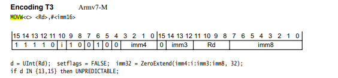
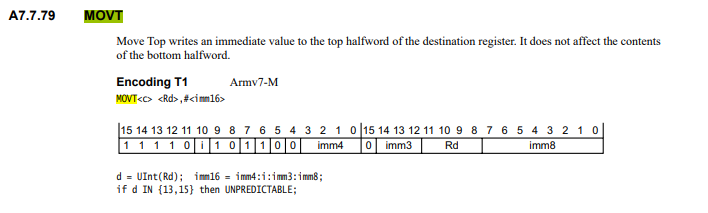

# MOVW



# MOVT



可以看到，movw和movt指令的作用是将一个32位的立即数加载到寄存器中，movw指令将低16位加载到寄存器的低16位，movt指令将高16位加载到寄存器的高16位。
并且imm的一位是在第十位的，所以，构建指令本身的二进制时，需要考虑到这一点。

以下是一个计算二进制的例子：
```c
uint32_t movw_calculate(uint32_t ori_val, uint32_t addr) {
  addr = addr & 0xffff;
  ori_val = ori_val & 0x0f00f0f0;
  if ((addr & 0xf00) >= 0x800) {
    addr = addr - 0x800;
    ori_val = ori_val | 0x00000600;
  } else {
    ori_val = ori_val | 0x00000200;
  }

  uint32_t new_val = ori_val | ((addr & 0xf00) << 20) | ((addr & 0xff) << 16) |
                     ((addr & 0xf000) >> 12);
  return new_val;
}
```